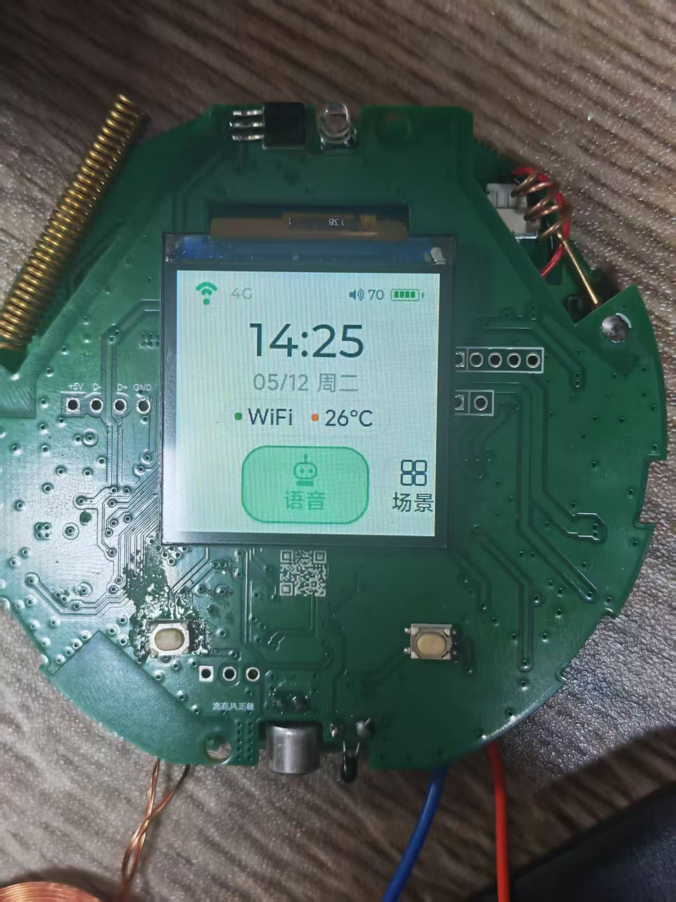
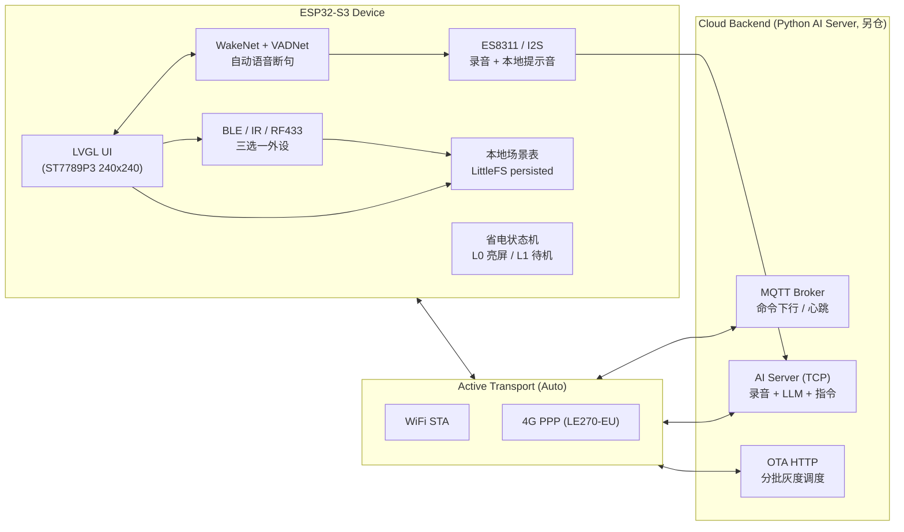

# ESP32-S3 SmartPanel

<p align="center">
  
</p>

> 基于 **ESP-IDF v5.5** 的 ESP32-S3 智能面板量产固件 —— 1.54" LCD + 语音唤醒 + BLE 空调控制 + 红外/433 学习 + 4G/WiFi 双链路 + MQTT/OTA 全套云端协同。

本仓库展示嵌入式固件部分（C/C++/ESP-IDF）。配套的 Python AI Server（语音识别、LLM 推理、设备指令下发）不在本仓库公开。

---

## 硬件平台

| 项 | 规格 |
|---|---|
| MCU | ESP32-S3FN8（双核 Xtensa LX7 @ 240MHz） |
| Flash / PSRAM | 8 MB / 8 MB（外置 Quad SPI） |
| 显示 | ST7789P3 1.54" 240×240 SPI |
| 音频 | ES8311 codec + NS4150B 功放（I2S + I2C） |
| 蜂窝 | LE270-EU Cat.1 4G（UART2，PPP 拨号） |
| 无线 | WiFi STA/AP + BLE（NimBLE） + CMT2300A 433 MHz + IR RX/TX |
| 输入 | ADC 多键（GPIO3 单线分压） |
| 传感 | 电池电压（GPIO1）、NTC 温度（GPIO2）、充电检测（GPIO37） |

ESP32-S3 内部 SRAM 仅约 320 KB 且需要给 WiFi/BLE/LWIP 留出空间，本项目所有任务栈和大型 buffer 的内/外存分配都做过严格预算（详见 [`docs/memory-notes.md`](docs/memory-notes.md)）。

---

## 系统架构



主流程入口：[`src/idf_bootstrap.cpp`](src/idf_bootstrap.cpp) 的 `app_main()`，按顺序拉起 NVS、Flash guard、LittleFS、网络栈（WiFi+4G）、MQTT、OTA、音频、唤醒词、LVGL UI、ADC 输入、传感器、按当前模式启动 BLE/IR/RF433 三选一外设、场景管理、命令执行器、健康日志与省电状态机。

---

## 技术亮点（My Contributions）

下面这些是项目里我设计/独立实现、踩过坑总结沉淀的部分。

### 1. BLE / IR / RF433 三选一互斥状态机
NimBLE 协议栈在 ESP-IDF 5.x 上 `deinit` 后 `init` 会偶发 `hci init failed`，无法真正热卸载。我把外设切换设计为 **NVS 持久化 + 软重启**：`AppIdfAppMode` 在 `app_main` 早期读取模式，bootstrap 据此**条件化启动**对应任务，UI 切换走 `switchAndRestart(mode)` (写 NVS → 800 ms → `esp_restart`)，绕开热卸载问题。
→ [`src/idf/App_IdfAppMode.cpp`](src/idf/App_IdfAppMode.cpp)

### 2. 433 MHz CMT2300A Direct-TX bit-banging
不使用 SPI peripheral 的硬件 OOK，而是 GPIO 软件直翻 + 时序聚类投票学习：4 状态机 `IDLE / LEARN_CLOUD / LISTEN_NORMAL / SNIFF_RAW`，最多 8 候选，T 容差 12%、bitLen 差 ≤12，评分函数 `members*1000 + bits*10 + ratio - dispersion + sync*20`。
**坑：**600 ms bit-banging 不能在 LVGL 任务跑（LCD DMA 中断会切碎 OOK pulse），单独 core-0 worker + Direct-TX 三件套寄存器（`IO_SEL=0x10 / FIFO_CTL=0xC0 / MODE_CTL=0x40` 缺一不可，state ID 顺序 3=TFS 4=RFS 5=RX 6=TX）。
→ [`src/idf/App_IdfRf433.cpp`](src/idf/App_IdfRf433.cpp)

### 3. IR 红外学习 / 回放（RMT）
RMT TX/RX 共存：IDF 5.x 一旦 `rmt_transmit`，RX 通道会进入 *not-enable* 状态。每次 send 前后用 `rmt_disable(rx) / rmt_enable(rx)` 包裹。学习侧 djb2 指纹去重 + 二次按键确认，cJSON 持久化到 LittleFS。
→ [`src/idf/App_IdfIr.cpp`](src/idf/App_IdfIr.cpp)

### 4. WakeNet + VADNet 双任务自动语音断句
单麦 AFE，仅启用 WakeNet（`wn9_nihaoxiaoan_tts2`） 做唤醒，唤醒后临时挂载 VADNet（`vadnet1_medium`）做断句录音，停止后释放。整路 PCM 走 512 KB PSRAM ring buffer，结束播 `wake_ack` cue 后再通过 active transport 上传到 AI Server。
→ [`src/idf/App_IdfWakeWord.cpp`](src/idf/App_IdfWakeWord.cpp) / [`App_IdfVadNet.cpp`](src/idf/App_IdfVadNet.cpp) / [`App_IdfRecorder.cpp`](src/idf/App_IdfRecorder.cpp)

### 5. 双链路 Active Transport（WiFi ↔ 4G PPP）
`AppIdfTransport` 维护一个 `active = NONE / WIFI / PPP_4G` 切换：AUTO 模式 WiFi 优先、断流 10 秒后启动 4G PPP 兜底、WiFi 恢复 15 秒后回切。**关键设计：录音/上传/OTA/Flash guard 活跃时延迟切换**，避免业务被网络切换打断。切换时先断 MQTT、再改默认路由、再重连 MQTT。
**坑：**LE270-EU 模块的 `AT+IPR` 不写盘掉电会漂回 115200，加 `AT&W` 永久化 + `syncBaudRate` 自动救场。
→ [`src/idf/App_IdfTransport.cpp`](src/idf/App_IdfTransport.cpp) / [`App_IdfCellular.cpp`](src/idf/App_IdfCellular.cpp)

### 6. OTA preflight + pending-verify 回滚
启用 `CONFIG_BOOTLOADER_APP_ROLLBACK_ENABLE`。OTA 必须携带 `request_id` 并通过 preflight（版本 / 充电 / 电量 / 录音 / 分区大小）才允许下载。下载使用 1024 B 内部 SRAM 流式 buffer 边写边算 MD5，重启后处于 `ESP_OTA_IMG_PENDING_VERIFY`：MQTT 成功重连即 `esp_ota_mark_app_valid_cancel_rollback`，120 秒未确认且存在旧分区则回滚。
**坑：**USB 烧录的版本无前任 OTA entry，IDF otadata 机制下首次 OTA 完成后 `rollback_is_possible=false`，从第二次起 rollback 才真正生效。
→ [`src/idf/App_IdfOta.cpp`](src/idf/App_IdfOta.cpp)

### 7. 低电量四级状态机 + 省电 L0/L1
`NORMAL → WARN_25 → COUNTDOWN_15 → EMERGENCY_8` 自动触发 cue、倒计时弹窗、`deep_sleep`，阈值集中在 [`include/Battery_Config.h`](include/Battery_Config.h)。省电状态机挂在 1 Hz `esp_timer`（不开任务），60 秒无活动且抑制条件全过则进 L1（关背光 + WiFi `PS_MIN_MODEM` + LVGL 降频），按键 / 唤醒词钩子立即退出。
→ [`src/idf/App_IdfSensors.cpp`](src/idf/App_IdfSensors.cpp) / [`App_IdfPowerSave.cpp`](src/idf/App_IdfPowerSave.cpp)

### 8. LVGL GB2312 一级字库 + RLE 压缩
原始字体只覆盖 423 字，扩到 GB2312 一级 3755 字会占满 Flash，启用 `LV_USE_FONT_COMPRESSED` 走 RLE 压缩 + 字库分页加载，最终 app 分区占用约 69%（单 OTA slot 0x300000）。

### 9. 全链路串口诊断命令
[`App_IdfConsole`](src/idf/App_IdfConsole.cpp) 提供 60+ 命令覆盖：内存 / 分区 / FS / 显示 / 按键 / 传感器 / WiFi / 4G PPP / MQTT / OTA / 服务器 TCP probe / 录音上传 / WakeWord / I2C/I2S 自检 / BLE 扫描配对 / `AICMD=<json>` 业务协议验证 / 主题切换。**无需重烧固件即可端到端调试**——出厂排查、客服远程定位都靠它。

---

## 项目结构

```
.
├── src/
│   ├── idf_bootstrap.cpp        # app_main() — 全栈拉起入口
│   ├── idf/                     # ESP-IDF 业务层（25+ 模块）
│   │   ├── App_IdfMqtt.cpp      # MQTT 5min 心跳 + 命令下行
│   │   ├── App_IdfOta.cpp       # OTA preflight + rollback
│   │   ├── App_IdfTransport.cpp # WiFi/4G 双链路切换
│   │   ├── App_IdfBleAircon.cpp # NimBLE 空调控制
│   │   ├── App_IdfIr.cpp        # RMT IR 学习/回放
│   │   ├── App_IdfRf433.cpp     # CMT2300A 433 bit-banging
│   │   ├── App_IdfScene.cpp     # 本地场景表（cJSON）
│   │   ├── App_IdfRecorder.cpp  # WakeNet + VAD + 上传
│   │   └── ...
│   └── ui_*.c                   # LVGL 生成界面文件
├── include/                     # 头文件 + 引脚 / 电量配置
├── components/                  # 本地 ESP-IDF component wrapper
├── lib/                         # 第三方依赖（esp-sr 等）
├── docs/                        # 项目现状文档（按子系统拆分）
├── tools/                       # Python 调试 / 烧录辅助工具
├── data/                        # LittleFS 镜像源（语音 cue 等）
├── board_models/                # 唤醒词模型分区镜像
├── partitions_8mb_espsr.csv     # 8MB Flash 分区表（带 model 分区）
├── sdkconfig.defaults
└── CMakeLists.txt
```

详细模块文档见 [`docs/`](docs/README.md)：架构、内存、显示、音频、网络、OTA、BLE、IR/433、场景、省电、串口工具——每个子系统一份。

---

## 编译与烧录（参考）

> 公开版本里 MQTT broker / 服务器 host 已替换为 `<your-...>` 占位符，需自行修改 [`src/idf/App_IdfMqtt.cpp`](src/idf/App_IdfMqtt.cpp) 与 [`src/idf_bootstrap.cpp`](src/idf_bootstrap.cpp) 后再编译。

```bash
idf.py set-target esp32s3
idf.py build
idf.py -p PORT flash
idf.py -p PORT monitor -b 921600
```

ESP-IDF 版本：**v5.5.4**（已验证）。详见 [`docs/partitions-and-build.md`](docs/partitions-and-build.md)。

> 第三方依赖（esp-sr / lvgl / 等）不随仓库分发；首次 build 由 ESP-IDF Component Manager 根据 `src/idf_component.yml` 自动拉取，或参考各依赖原仓库手动放入 `lib/`。

---

## License

仅作个人作品集展示用途。如需复用代码请提前联系。
